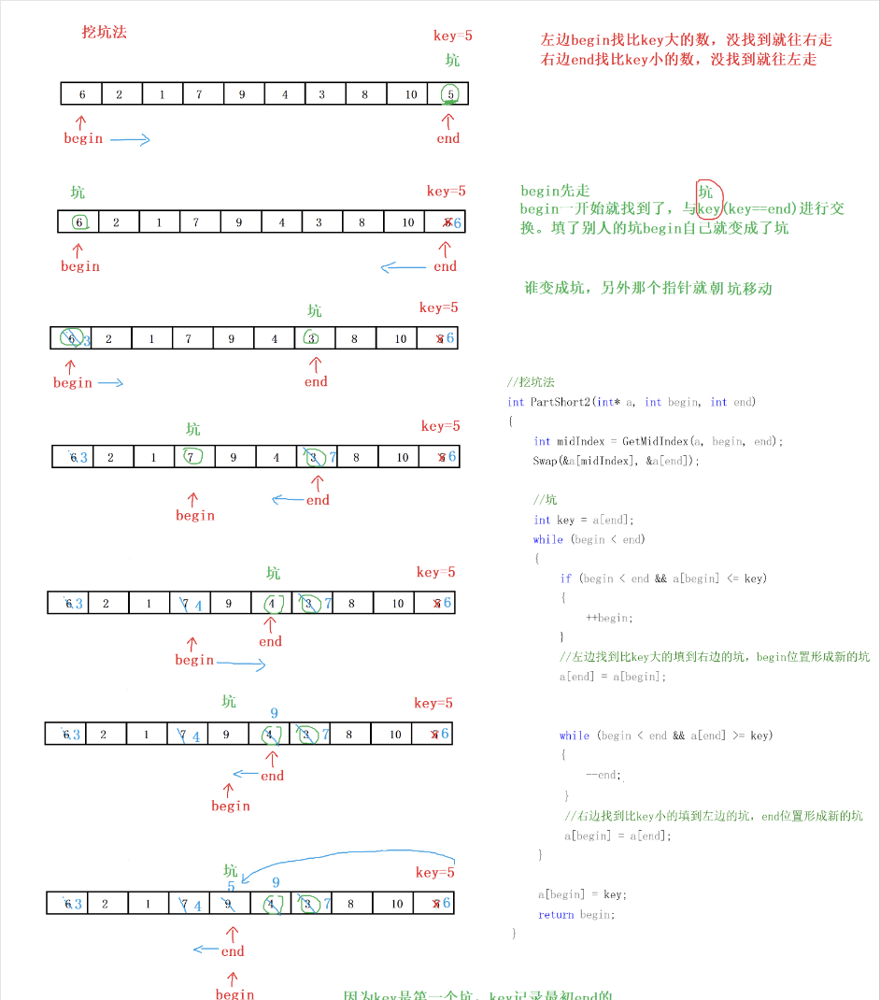

# 双指针

- 快慢指针

  1. 快慢指针就是用一快一慢两个指针来遍历数据对象并解决问题
  2. 在原先数值不再被需要的时候,可以节省内存空间,比如去重。快指针用于遍历,慢指针用于指向下一个需要被赋值的位置。

  - [283. 移动零](https://leetcode.cn/problems/move-zeroes/)(在原先数值不再被需要的时候)
  - [876. 链表的中间结点(一个指针移动速度是另一个的两倍)](https://leetcode.cn/problems/middle-of-the-linked-list/)
  - [80. 删除有序数组中的重复项 II](https://leetcode.cn/problems/remove-duplicates-from-sorted-array-ii/)
  - [142. 环形链表 II](https://leetcode.cn/problems/linked-list-cycle-ii/)
  - [141. 环形链表](https://leetcode.cn/problems/linked-list-cycle/)
  - [寻找链表中的倒数第k个节点]
- 对撞指针

    两个指针，一个位于头，一个位于尾，它们向中间移动（主要应用于[有序数组](https://so.csdn.net/so/search?q=%E6%9C%89%E5%BA%8F%E6%95%B0%E7%BB%84&spm=1001.2101.3001.7020)）

    - [11. 盛最多水的容器](https://leetcode.cn/problems/container-with-most-water/)
    - [125. 验证回文串](https://leetcode.cn/problems/valid-palindrome/)
    - [167. 两数之和 II - 输入有序数组](https://leetcode.cn/problems/two-sum-ii-input-array-is-sorted/)
    - [快速排序](https://blog.csdn.net/weixin_61125362/article/details/135628826?ops_request_misc=&request_id=&biz_id=102&utm_term=%E5%BF%AB%E9%80%9F%E6%8E%92%E5%BA%8F&utm_medium=distribute.pc_search_result.none-task-blog-2~all~sobaiduweb~default-1-135628826.142^v100^pc_search_result_base7&spm=1018.2226.3001.4187)

    
    
- 滑动窗口

  对于一个数组的子区间.
    K
  - 定长滑动窗口

    - [567. 字符串的排列](https://leetcode-cn.com/problems/permutation-in-string/)
      (哈希)

    ```c
    bool equals(int* cnt1, int* cnt2) {
        for (int i = 0; i < 26; i++) {
            if (cnt1[i] != cnt2[i]) {
                return false;
            }
        }
        return true;
    }
    bool checkInclusion(char* s1, char* s2) {
        int len1=strlen(s1);
        int len2=strlen(s2);
        if(len1>len2){
            return false;
        }
        int l1[26]={0};
        int l2[26]={0};
        for(int i=0;i< len1;i++){
            l1[s1[i]-'a']++;
            l2[s2[i]-'a']++;
        }
        if(equals(l1,l2)){
            return true;
        }
        for(int i=len1;i<len2;i++){
            l2[s2[i-len1]-'a']--;
            l2[s2[i]-'a']++;
            if(equals(l1,l2)){
                return true;
            }
        }
        return false;
    }
    ```

    - [76. 最小覆盖子串](https://leetcode-cn.com/problems/minimum-window-substring/)
      ()
  - 滑动窗口 /至多
  - [3. 无重复字符的最长子串](https://leetcode-cn.com/problems/longest-substring-without-repeating-characters/)
    (哈希)
  - [3090.  每个字符最多出现两次的最长子字符串](https://leetcode.cn/submissions/detail/579169363/)
  - [2106. 摘水果](https://leetcode.cn/problems/maximum-fruits-harvested-after-at-most-k-steps/)(有折返)
  - 不定长滑动窗口 /至少

    - [209. 长度最小的子数组](https://leetcode.cn/problems/minimum-size-subarray-sum/)

    ```c
    int minSubArrayLen(int target, int* nums, int numsSize) {

        int i=1,j=0;
        int ret=numsSize;
        int sum=0;
        int r=0;
        for(i=0 ;i<numsSize ;i++ )
        {   
            sum+=nums[i];
            while(sum>=target){
            r=1;
            if(ret>i-j+1) 
                ret=i-j+1;
            sum-=nums[j];
            j++;
            } 
        }
    if(!r)
    return 0;
    else return ret;
    }
    ```

https://leetcode.cn/circle/discuss/0viNMK/
